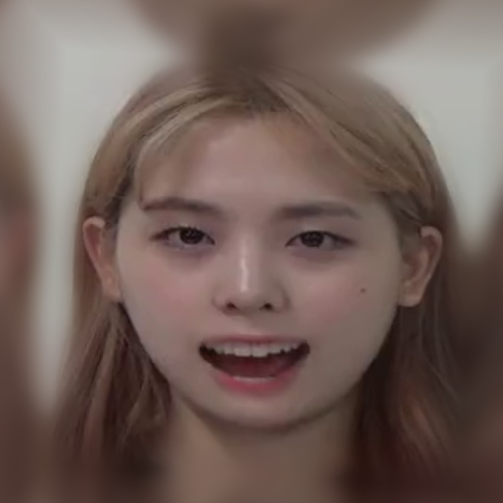

# Blending(CV2) + FaceParsing(BiSeNet/Pytorch)
## Info
Blending(CV2) + FaceParsing(BiSeNet/Pytorch)

## Environment
pytorch : 1.4.0 <br />
python : 3.6

## Result

<br />
<div align="center">
  
  
  
</div>


## Usage

1) Run code
```
python laplacian_blend.py
```

## Code Reference
Blending code based on [morethantechnical](https://www.morethantechnical.com/2017/09/29/laplacian-pyramid-with-masks-in-opencv-python/)
FaceParsing code based on [zllrunning](https://github.com/zllrunning/face-parsing.PyTorch)

## Author
[Gie-ok-Hie-ut](https://github.com/Gie-ok-Hie-ut)
